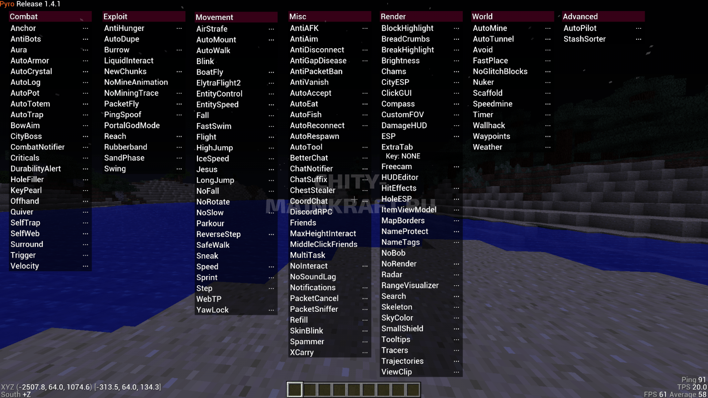

# Pyro

### Relevant Links

Official Website: [https://pyroclient.com](https://pyroclient.com)

Official Showcase:  [https://www.youtube.com/watch?v=TLKQUlMH7Qw](https://www.youtube.com/watch?v=TLKQUlMH7Qw)

### Important Information

Price: $20  
Is Safe: Yes

Developers: ionar, GiantNuker

### Information

Pyro Client is one of the worst clients to ever come into existence. It is a blatant SalHack skid and the AutoCrystal uses Ghost Crystals, meaning it fakes the actual speed of the AutoCrystal effectively making the selling point of the client a scam. Due to the idiotic nature of its users the term "pyro ape" became a derogatory term to describe players who use Pyro Client. It is common to see anarchy players insult and attack those who use it. The client resides in such infamy that the "Support Discord" is a place of shit posts and no coherent or reasonable discussion has or will ever happen there. The developers of the client also censor accusations of skidding and the AutoCrystal scam. Whatever you do, do not purchase Pyro Client. 

The client was also thought to have exit scammed in early 2021 due to the website being down for several weeks meaning Pyro Users could not access the user dashboard which is essential to actually downloading and using the client.

However if you choose to look past the flaws of Pyro Client, it does have some decent render modules along with a \(patched\) AutoDupe.

